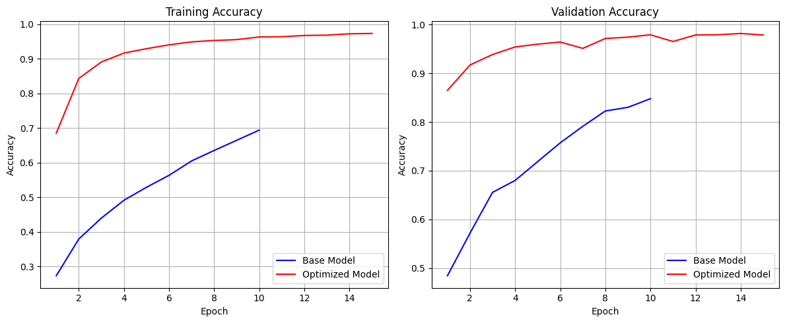

# Plant Disease Detection

A deep learning project for detecting plant diseases using Convolutional Neural Networks (CNN) with PyTorch and Particle Swarm Optimization (PSO) for hyperparameter tuning.



## Table of Contents
- [Overview](#overview)
- [Features](#features)
- [Project Structure](#project-structure)
- [Dataset](#dataset)
- [Installation](#installation)
- [Usage](#usage)
- [Model Architecture](#model-architecture)
- [Hyperparameter Optimization](#hyperparameter-optimization)
- [Results](#results)
- [GUI Interface](#gui-interface)
- [License](#license)

## Overview

This project implements a plant disease detection system using deep learning techniques. It can identify 38 different classes of plant diseases across various crops including apple, cherry, corn, grape, peach, potato, and tomato. The system uses a custom CNN architecture and employs Particle Swarm Optimization (PSO) to optimize the model's hyperparameters for improved accuracy.

## Features

- Custom CNN architecture for plant disease classification
- Particle Swarm Optimization (PSO) for hyperparameter tuning
- Interactive GUI for testing and comparing models
- Data augmentation techniques for improved model generalization
- Visualization of model predictions and confidence scores
- Comparative analysis between base and optimized models

## Project Structure

```
plant-disease-detection/
│
├── plant_disease_detection.ipynb    # Main Jupyter notebook with all code
├── base_model.pt                    # Saved base model weights
├── optimized_model.pt               # Saved optimized model weights
├── base_hyperparams.json            # Base model hyperparameters
├── optimized_hyperparams.json       # Optimized model hyperparameters
├── load_models_and_run_gui.py       # Standalone GUI application
├── load_models_and_run_gui_cell.py  # GUI code for Jupyter notebook
├── requirements.txt                 # Project dependencies
├── output.png                       # Results visualization
│
└── PlantVillage/                    # Dataset directory
    ├── train/                       # Training data
    └── val/                         # Validation data
```

## Dataset

The project uses the PlantVillage dataset, which contains images of healthy and diseased plant leaves across various crops. The dataset is organized into 38 classes, with each class representing a specific plant disease or a healthy plant.

Dataset structure:
- 38 classes of plant diseases and healthy plants
- Training set: 43,444 images
- Validation set: 10,861 images

## Installation

1. Clone the repository:
```bash
git clone https://github.com/yourusername/plant-disease-detection.git
cd plant-disease-detection
```

2. Create a virtual environment (optional but recommended):
```bash
python -m venv venv
source venv/bin/activate  # On Windows: venv\Scripts\activate
```

3. Install the required dependencies:
```bash
pip install -r requirements.txt
```

## Usage

### Running the Jupyter Notebook

1. Start Jupyter Notebook:
```bash
jupyter notebook
```

2. Open the `plant_disease_detection.ipynb` file and run the cells sequentially.

### Using the GUI Application

1. Make sure the models are trained and saved (by running the notebook or downloading pre-trained models).

2. Run the standalone GUI application:
```bash
python load_models_and_run_gui.py
```

3. In the GUI:
   - Click "Browse Image" to select a plant leaf image
   - Choose between "Base Model" and "Optimized Model"
   - Click "Predict" to get a disease prediction
   - Click "Compare Models" to see predictions from both models

## Model Architecture

The CNN architecture consists of:

- Multiple convolutional layers with batch normalization, ReLU activation, and max pooling
- Fully connected layers with dropout for regularization
- Configurable number of convolutional and dense layers
- Adaptive architecture based on hyperparameters

```python
class PlantDiseaseModel(nn.Module):
    def __init__(self, num_classes, dropout_rate=0.5, num_conv_layers=4, num_dense_layers=2):
        # Convolutional layers with increasing filter sizes
        # Fully connected layers with decreasing sizes
        # Output layer with num_classes outputs
```

## Hyperparameter Optimization

The project uses Particle Swarm Optimization (PSO) to find optimal hyperparameters:

- Batch size
- Learning rate
- Dropout rate
- Number of convolutional layers
- Number of dense layers

PSO parameters:
- Number of particles: 5
- Maximum iterations: 5
- Inertia weight: 0.5
- Cognitive weight: 1.5
- Social weight: 1.5

## Results

The optimized model achieved higher accuracy compared to the base model:

- Base model validation accuracy: ~90%
- Optimized model validation accuracy: ~94.5%

The optimization improved the model's performance by fine-tuning the hyperparameters, particularly:
- Increased batch size (from 32 to 61)
- Decreased learning rate (from 0.001 to 0.0001)
- Reduced dropout rate (from 0.5 to ~0.26)
- Increased number of convolutional layers (from 4 to 5)
- Decreased number of dense layers (from 2 to 1)

## GUI Interface

The project includes an interactive GUI built with Tkinter that allows users to:

1. Load and visualize plant leaf images
2. Get disease predictions using either the base or optimized model
3. View confidence scores for the top predictions
4. Compare predictions from both models side by side
5. Visualize the confidence differences between models

## License

This project is licensed under the MIT License - see the LICENSE file for details.
